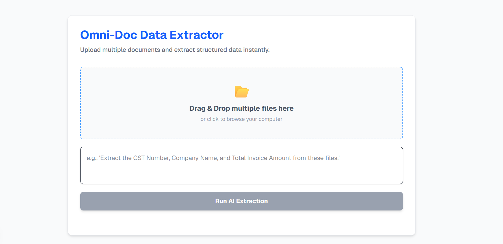
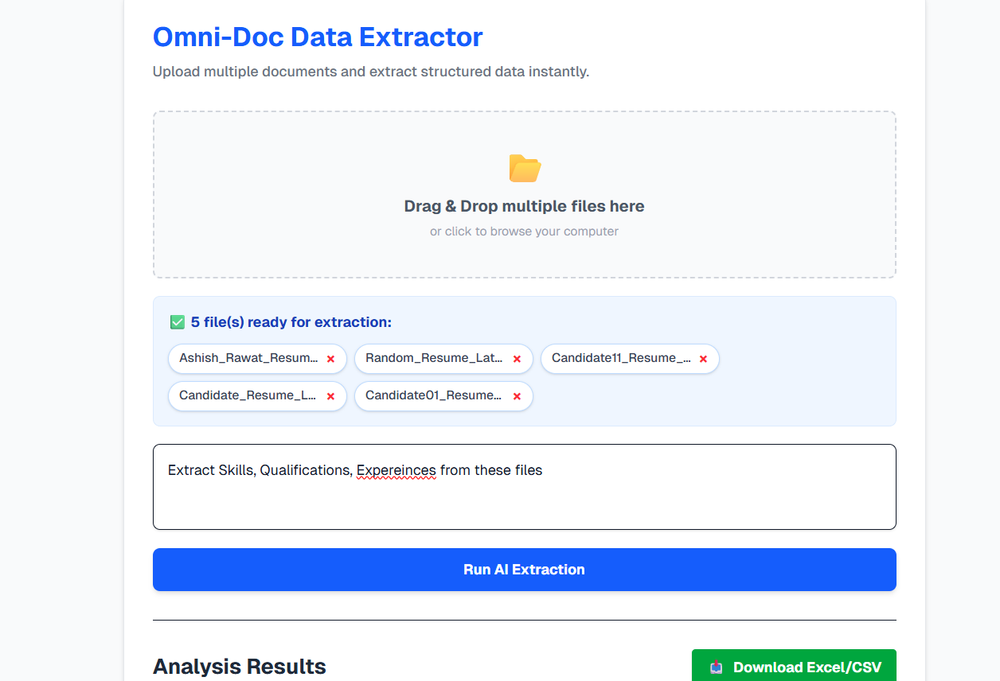
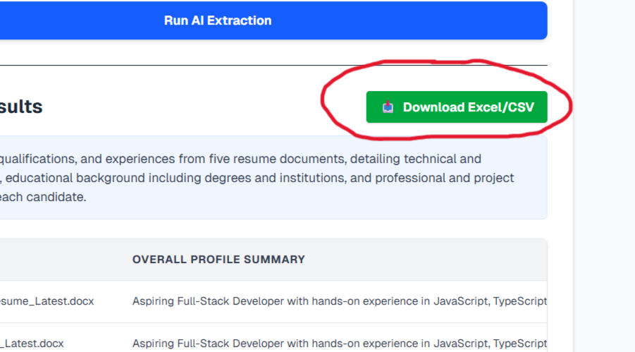

# 🚀 Omni-Doc AI Parser

[](https://fastapi.tiangolo.com/)
[](https://nextjs.org/)
[](https://ai.google.dev/)
[](https://www.python.org/)

**Omni-Doc AI Parser** is a powerful full-stack application that leverages Google's **Gemini 2.5 Flash** to intelligently extract structured data from PDF and DOCX documents based on custom user prompts.

---

## 📸 App Screenshots

<div align="center">
  
  
  
</div>

---

## ✨ Features
- 📂 **Multi-file Upload**: Process multiple PDF and DOCX files simultaneously.
- 🤖 **AI-Powered Extraction**: Uses advanced LLMs to understand document context.
- 📋 **Structured JSON**: Guaranteed valid JSON output, tailored to your extraction needs.
- ⚡ **Real-time Processing**: Fast and efficient handling of large documents.
- 🎨 **Modern UI**: Sleek, responsive interface built with Next.js and Tailwind CSS.

---

## 🛠️ Core Technologies
- **Backend:** [FastAPI](https://fastapi.tiangolo.com/), [Uvicorn](https://www.uvicorn.org/)
- **Frontend:** [Next.js](https://nextjs.org/), [Tailwind CSS](https://tailwindcss.com/)
- **AI Model:** [Google Gemini 2.5 Flash](https://ai.google.dev/) (via `google-generativeai`)
- **Document Parsing:** [PyPDF2](https://pypdf2.readthedocs.io/), [python-docx](https://python-docx.readthedocs.io/)

---

## 🚀 Getting Started

### 📋 Prerequisites
- **Python** 3.8 or higher
- **Node.js** 18 or higher
- **GitHub Account** (optional, for deployment)
- **Google AI Studio API Key** ([Get it here](https://aistudio.google.com/app/apikey))

### 🔧 Installation & Setup

#### 1. Backend Setup
Navigate to the project root and follow these steps:

```bash
# Create and activate a virtual environment (optional but recommended)
python -m venv venv
source venv/bin/activate  # On Windows, use `venv\Scripts\activate`

# Install dependencies
pip install -r requirements.txt

# Configure environment variables
# Create a .env file and add:
# GEMINI_API_KEY="your_actual_key_here"

# Start the server
uvicorn main:app --reload
```
The backend will be available at `http://localhost:8000`.

#### 2. Frontend Setup
Navigate to the `doc-parser-ui` directory:

```bash
cd doc-parser-ui

# Install dependencies
npm install

# Start the development server
npm run dev
```
The frontend will be available at `http://localhost:3000`.

---

## 📖 How It Works
1. **Document Upload**: Users upload PDF/DOCX files and provide a "schema prompt" (e.g., "Extract all GST numbers and invoice amounts").
2. **Text Extraction**: The FastAPI backend parses the documents using `PyPDF2` or `python-docx`.
3. **AI Inference**: The extracted text and the user prompt are sent to **Gemini 2.5 Flash**. The model is configured to return a strict JSON response.
4. **Data Display**: The frontend receives the JSON and presents the extracted data in a clean, readable format.

---

## 📄 License
Distributed under the MIT License. See `LICENSE` for more information.

---

## 🤝 Contributing
Contributions are what make the open-source community such an amazing place to learn, inspire, and create. Any contributions you make are **greatly appreciated**.

1. Fork the Project
2. Create your Feature Branch (`git checkout -b feature/AmazingFeature`)
3. Commit your Changes (`git commit -m 'Add some AmazingFeature'`)
4. Push to the Branch (`git push origin feature/AmazingFeature`)
5. Open a Pull Request

---

## 📬 Contact
Ashish - [GitHub](https://github.com/Ashish13042)
Project Link: [https://github.com/Ashish13042/omni-doc-parser](https://github.com/Ashish13042/omni-doc-parser)
